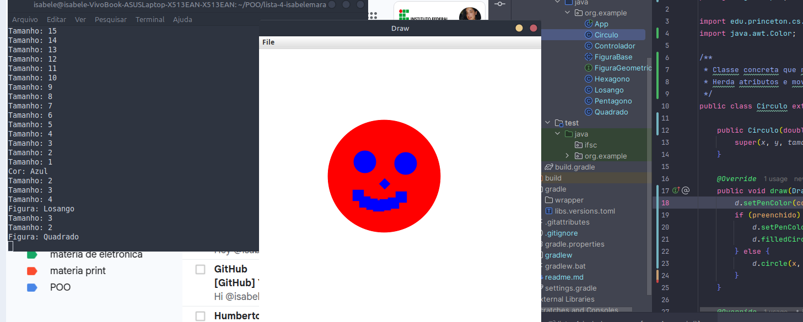

✅ Como utilizar o aplicativo
🖱️ Usar o mouse para desenhar:

Clique na tela com o botão esquerdo do mouse para imprimir uma figura na posição clicada.

A figura será do tipo, cor, tamanho e modo (preenchida ou vazada) atualmente selecionados.

🎨 Selecionar o tipo de figura (teclas de função):

F1 → Círculo

F2 → Quadrado

F3 → Losango

F4 → Hexágono

🌈 Selecionar a cor:

F5 → Vermelho

F6 → Azul

F7 → Verde

F8 → Amarelo

🖌️ Alternar preenchimento:

F → alterna entre figura preenchida (cor personalizada) ou vazada (somente contorno na cor escolhida).

📏 Ajustar tamanho:

W → aumenta o tamanho da figura.

Q → diminui o tamanho da figura.

🧭 Mover todas as figuras:

Seta ↑ → Move todas para cima

Seta ↓ → Move todas para baixo

Seta ← → Move todas para a esquerda

Seta → → Move todas para a direita

🧹 Limpar a tela:

C → Remove todas as figuras desenhadas.

📊 Exibir estatísticas no terminal:

P → Mostra no terminal:

Número total de figuras desenhadas

Soma dos perímetros

Área média

